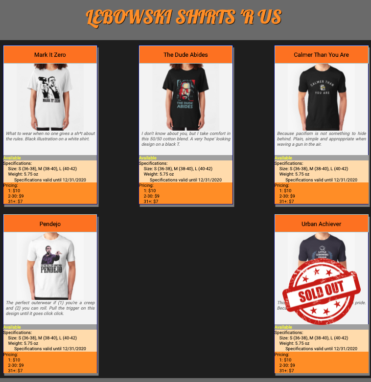

# Product Cards
This web site is a simple display of product cards in the form of T-shirts for sale on a *Big Lebowski* themed online store. 

It was built as an exercise to learn how to use CSS and HTML styling elements.

## Features
* The site is responsive to the size of the user's screen
* A "sold out" graphic is overlaid on one of the T-shirt cards to indicate its unavailability.

## Screenshot

## Installation
* Clone this repo to your local machine using `https://github.com/petestewart72/product-cards`
* Run in any http server with `$ hs`

## Contributors
* [Pete Stewart](https://github.com/petestewart72)

## Technologies Used
 
